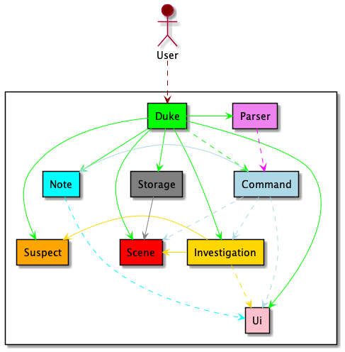
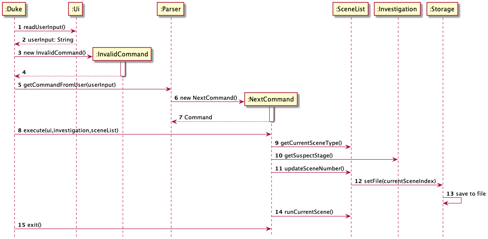
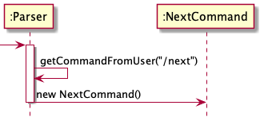
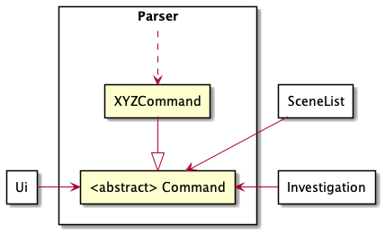
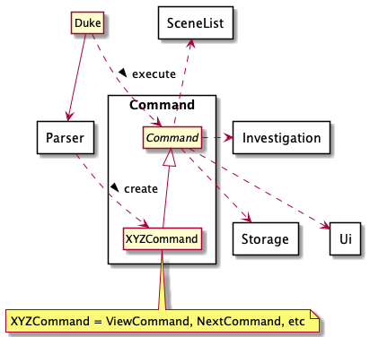
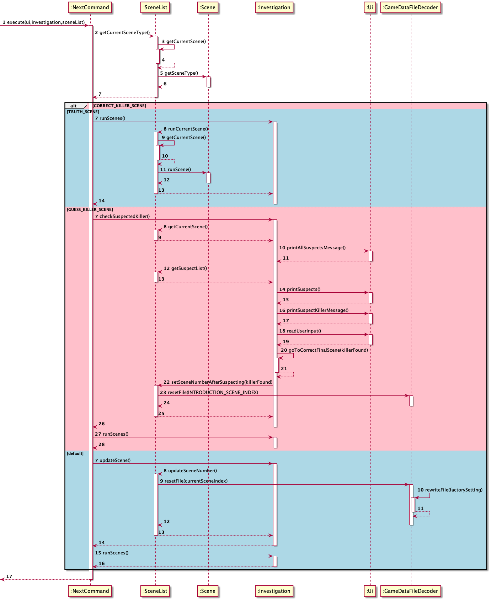
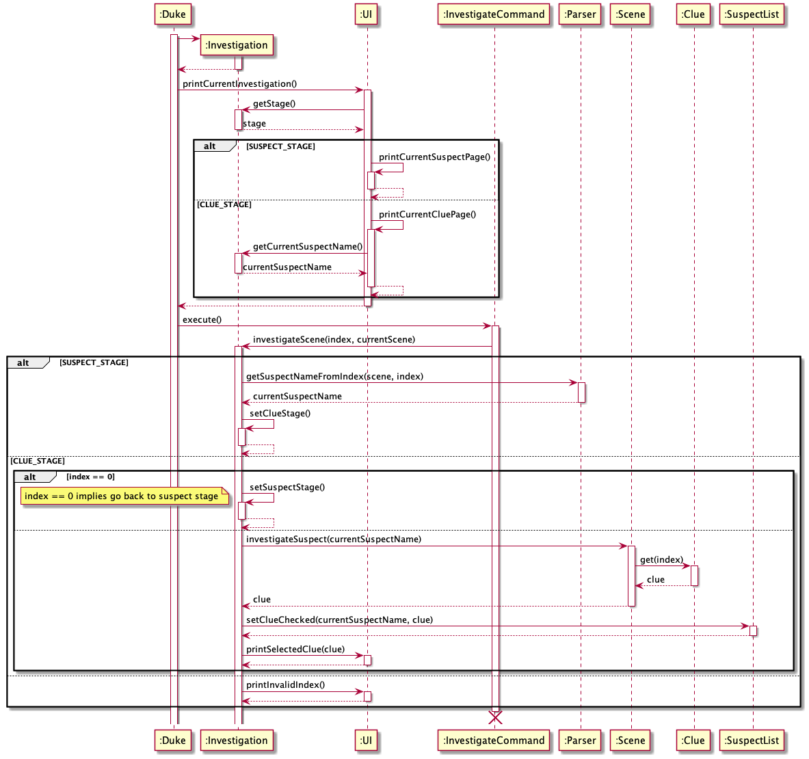
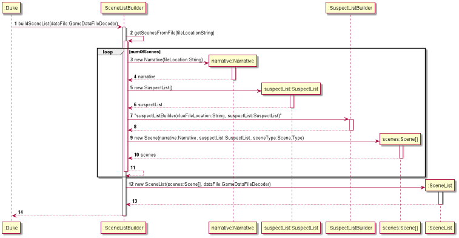
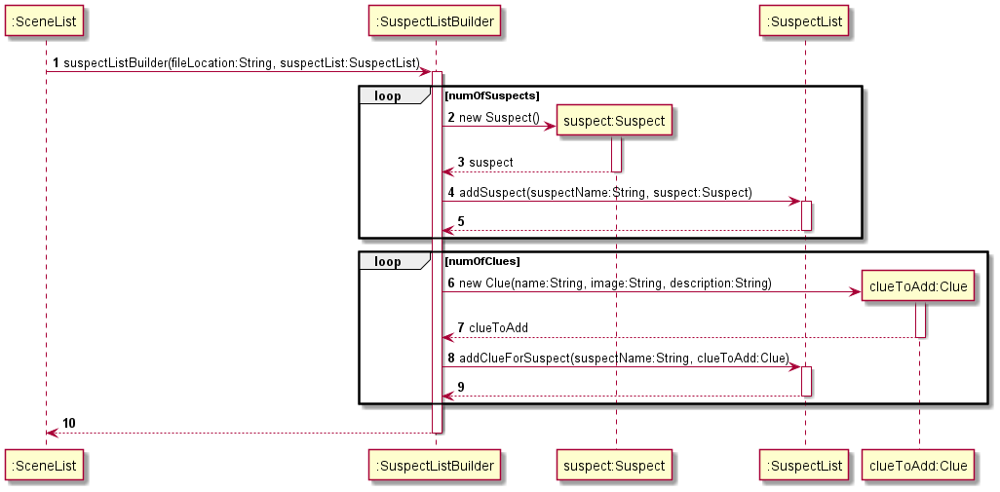

# Developer Guide

## Acknowledgements

The plot of the game was adopted from one of the games available in the Mini Program in WeChat called Ju Ben Sha. The original story was in Chinese and was translated to English with the help of Google Translate. 

## Design

### Architecture



The _**Architecture Diagram**_ given above explains the high-level design of the App.

Given below is a quick overview of main components and how they interact with each other.

**Main components of the architecture**

`Duke` is responsible for,

* At app launch: Initializes the components in the correct sequence, and connects them up with each other.
* During the game: Takes in user input and coordinates other components to parse and execute the input in a while loop, until the game is shut down.

The rest of the App consists of eight components.

`Parser`:
`Ui`:
`Command`: The command executor.
`Investigation`:
`Scene`:
`Suspect`:
`Note`:
`Storage`:

**How the architecture components interact with each other**

The Sequence Diagram below shows how the components interact with each other for the scenario where the user issues the command `/next`.



### Parser component
**API:** Parser.java 

The parser component is used to parse the input given by the user.

The Sequence Diagram below illustrates the interactions within the 
`Parser` component for the `getCommandFromUser("/next")` API call.



The class diagram below shows how the parser interacts with the other classes



How the parser work
- When the user gives an input, the parser will the appropriate command for this input.
- In the case of `/next` as the input, the NextCommand will be generated.
- The NextCommand is inherits from the abstract class Command.
- If the input does not generate a valid command type, it throws the invalidInputException.
- The abstract Command class requires SceneList, Ui and Investigate component as its dependencies. 

### Note component
**API:** Note.java

The note component allows user to create / open / delete /search note. 

How the note work
- When user want to take note, a note with title and content will be created and added 
  to note list.
- Notes in the note list can be found by their titles and scene index.
- Unwanted notes can be deleted.

### UI component
**API:** `Ui.java`

The ui component communicates with the user via the terminal. Other component call methods of 
ui to print output to terminal. 

How the ui work
- Print messages to terminal depending on the scene.
- Print corresponding output to terminal according to input command.

### Command component
**API:** `Command.java` 

Here’s a (partial) class diagram of the `Command` component:



How the `Command` componnet works:
1. The user input is first parsed using the `Parse` component
2. This results in a `Command` object (more precisely, an object of one of its subclasses e.g., NextCommand), which is executed by `Duke`.
3. The command can communicate with the `Ui`, `Investigation` and `SceneList` when it is executed (e.g. to go to the next scene).
4. Some of the commands may update the `Storage`.

The Sequence Diagram [below](./next_command_sequence_diagram.png) illustrates within the `Command` component for the `execute(ui,investigation,sceneList)` method call of the `NextCommand` class.



### Investigation component
**API:** `Investigation.java`



The investigation class manages the investigation in each investigation scene. 

How the `Investigation` component works:
- When an investigation command is returned from the parser, we investigate the input given by the user.
- Investigation are divided into two parts, suspect stage and clue stage
  - `Suspect Stage`: Prints the list of suspects and prompts user for input, user selects which suspect he/she wants 
to investigate. Proceeds to clue stage when input entered are valid
  - `Clue Stage`: Prints the list of clues available for viewing for the selected suspect previously and prompts user
for input, user selects which clue he/she wants to view. The user may enter the number '0' to return to the 
`Suspect Stage`. Otherwise, after selecting the clue, the clue is then marked as checked and contents of the selected 
clue is displayed on the terminal.
- The Investigation class is also used to determine if the user has managed to find the correct killer
at the end of the game.

### Scene component
**API:** `Scene.java`

The scene class contains and produces the narrative for the scene.
It also holds a suspectList, which contains the suspects and their respective clues.

How the scene class work
- Each scene has a scene type.
- For each scene type, we interact differently from the user.

See below for example.
- The introduction scene shows the introductory message to the user.
- The investigation scene asks the user either investigate a suspect or look into a clue.


### Storage component
**API:** `Storage.java`
The local Game Data Storage feature allows users to save the current game progress and resume the saved progress in the Future.
It is facilitated by ```java.io.File``` and ```java.io.FileWriter```.
It implements the following operations
- ```Storage#checkPath()``` -- Checks if there is a valid path to the data file, and creates a new data file if the data file is missing or hte path is invalid.
- ```Storage#readFile()``` -- Reads all the lines in the data files and store the information into a ```ArrayList<String>``` type Array List, then close the file.
- ```Storage#rewriteFile()``` -- Erase the content of the data file and rewrite from the start, then save and close the file.

At first ```Storage file = new Storage("name.txt")```, initialise the ```Storage``` class type with the name of the file.
Then ```file.checkPath()``` will check for existing data file and creates a new data file if the path ```./Data/name.txt```is invalid.
Then read the file and store the information into array list using ```ArrayList<String> content = file.readFile()```.
Eventually, edit the content and rewrite to data file using ```file.rewriteFile(content)```
### Suspect component
**API:** Suspect.java

The `Suspect` class contains an `ArrayList` of the class `Clue`. 

How the suspect class work:

  * Different suspects in a particular scene are stored in the `SuspectList` class.
  * Suspects are stored via a `LinkedHashMap<String, Suspect>`, with the string being the suspect's name.

See below for example:

  * The first investigation scene has a `SuspectList` containing one name, "Father", 
and four clues within its corresponding `Suspect` class.



## Implementation

This section describes some noteworthy details on how certain features are implemented.

### Display checked-clues feature

This feature allows the user to review the clues that have been gathered. The clues will be displayed according to the suspect they belong to.
To implement this feature, a clue tracker that contains all 5 suspects and all the clues corresponding to each suspect is used.
Whenever a clue is checked out by the user, the respective clue in the clue tracker will be marked as checked.
When the view feature is invoked, clues in the clue tracker will be iterated through. Once a checked-clue is found, it will be printed out for user tp review.

An alternative to this would be to update the clue status under each scene. However, this does not allow the display of clues according to different suspects.

### Local Game Data Storage

The local Game Data Storage feature allows users to save the current game progress and resume the saved progress in the Future.
It is facilitated by ```java.io.File``` and ```java.io.FileWriter```. 
It implements the following operations 
- ```Storage#checkPath()``` -- Checks if there is a valid path to the data file, and creates a new data file if the data file is missing or hte path is invalid.
- ```Storage#readFile()``` -- Reads all the lines in the data files and store the information into a ```ArrayList<String>``` type Array List, then close the file.
- ```Storage#rewriteFile()``` -- Erase the content of the data file and rewrite from the start, then save and close the file.

At first ```Storage file = new Storage("name.txt")```, initialise the ```Storage``` class type with the name of the file. 
Then ```file.checkPath()``` will check for existing data file and creates a new data file if the path ```./Data/name.txt```is invalid.
Then read the file and store the information into array list using ```ArrayList<String> content = file.readFile()```.
Eventually, edit the content and rewrite to data file using ```file.rewriteFile(content)```

###Taking Notes For Specified Scene

This note-taking feature allows users to take note whenever they want, and store these notes locally. All the locally saved notes will be loaded and accessible
for users to open. Each note contains three parts: scene index, title and content. The note index will be automatically set according to the current scene that 
user is investigating. Note tile and content are fulfilled by users. Default title will be given if user does not give a title. User can also search for an 
existing note by either search its title/scene index or directly open it by its sequence number (in the note list). User can also delete the unwanted notes by
typing in its sequence number.

### SuspectListBuilder

Suspects and clues used in different scenes can be kept in a txt file and created following a specific format.
It uses `java.io.File`, `java.util.Scanner`, and is implemented as:
* `suspectListBuilder(String fileLocation, SuspectList suspectList)` -- where `fileLocation` is the directory 
containing the specified text file and `suspectList` is the instance of class `SuspectList` that the suspects 
and clues are to be added into.

This method will search for the specified text file, throwing a `FileNotFoundException` if it is missing.
The text file will be written in such a way that the program can recognize how many suspects
and how many clues there are. It will first add the suspects from the file into the suspectList 
via the method `addSuspect(String suspectName, Suspect suspect)`, and then the clues via the 
method `addClueForSuspect(String suspectName, Clue clueToAdd)` to the suspect with the corresponding `suspectName`.


## Appendix

### Product scope

**Target user profile：**

- enjoy the playing interactive game
- enjoy mystery genre
- enjoy reading
- wants to take a break from visual games


**Value proposition：**

- Provide an alternative game for users to exercise creative thinking


## User Stories

|Priority|Version| As a ... | I want to ... | So that I can ...|
|--------|--------|----------|---------------|------------------|
| * * *|v1.0|new user|see all commands available|understand the game mechanics|
| * * *|v1.0|user|investigate the suspects available|better understand the suspect|
| * * *|v1.0|user|investigate the clues available|understand the story line better|
| * * *|v1.0|user|choose the suspect|see if I am able to solve the crime|
| * * |v2.0|user|resume the game after exiting|continue the game instead of restarting|
| * * |v2.0|user|write notes|look at the notes I have written for each scene and suspect|
| * |v2.0|user|go to previous scene|look at the narrative for the previous scene|


### Use Cases

(Use /next as an example)

Use case: Navigate to the next scene.

1. The user gives `/next` as input.
2. Parser parsed the `/next` input, returns a NextCommand.
3. NextCommand does a self-invocation and calls the `execute()` method.
4. NextCommand returns a boolean by self-invocating the `.exit()` method.
5. If it is the last scene of the game, `.exit()` returns true else false.

### Non-Functional Requirements
1. The game should work as long as java 11 is installed on the local machine.
2. A working keyboard to play the game and a monitor to read the text.


### Glossary


- Mainstream OS: Windows, Mac OS X, Unix, Linux

## Appendix: Instructions for manual testing

{Give instructions on how to do a manual product testing e.g., how to load sample data to be used for testing}
